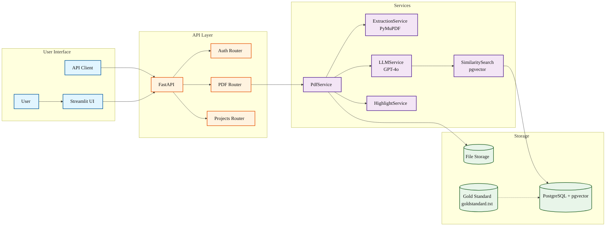
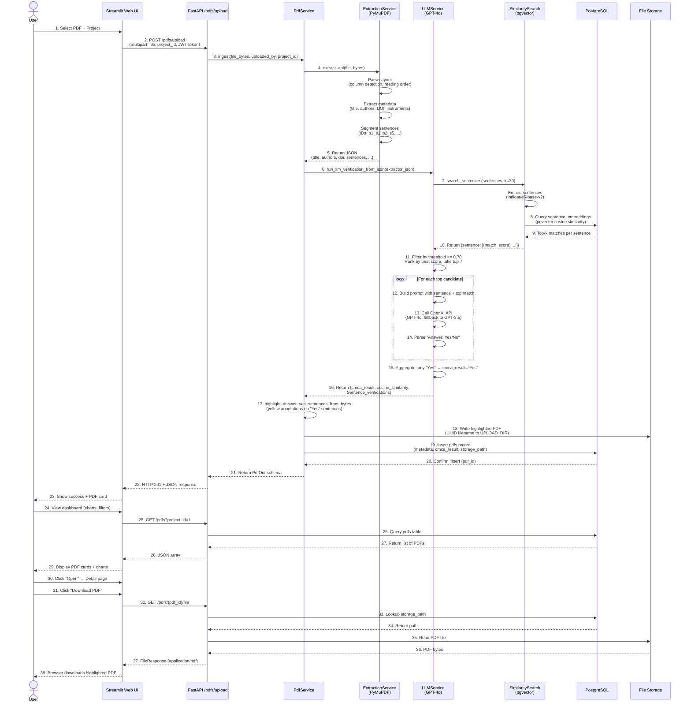

# Architecture

This document describes the system architecture, data flow, security model, and technical decisions for the CMCA Publication Audit System.

## System Overview

The system implements a hybrid heuristic + LLM pipeline for semi-automated publication auditing:

1.  **Ingest:** User uploads PDF via Web UI or REST API
2.  **Extract:** PyMuPDF parses text, metadata, and sentences with layout awareness
3.  **Score:** Sentence embeddings + cosine similarity filter candidates; GPT-4o classifies acknowledgements
4.  **Highlight:** Verified sentences are annotated with yellow highlights in PDF
5.  **Store:** Metadata persisted to PostgreSQL; annotated PDF saved to file storage
6.  **Review:** Streamlit dashboard provides filtering, charts, and detail views

## Architecture Diagrams

### Component Diagram




### Sequence Diagram


### Component Diagram2

```mermaid
%%{init: {
  'themeVariables': {
    'fontSize': '20px',
    'lineHeight': '1.6',
    'textColor': '#111111',
    'primaryTextColor': '#111111',
    'secondaryTextColor': '#111111',
    'tertiaryTextColor': '#111111',
    'edgeLabelBackground': '#ffffff',
    'fontFamily': 'Segoe UI, Roboto, Arial, sans-serif'
  },
  'flowchart': { 'curve': 'basis', 'htmlLabels': true, 'nodeSpacing': 80, 'rankSpacing': 100 }
}}%%
graph LR

subgraph User Interface
direction TB
U[User]
WEB[Streamlit UI]
API_CLIENT[API Client]
end

subgraph API Layer
direction TB
API[FastAPI<br/>app.main]
AUTH[Auth Router]
PDF_ROUTER[PDF Router<br/>/pdfs]
PROJ_ROUTER[Projects Router]
end

subgraph Services
direction TB
PDF_SVC[PdfService]
EXTRACT[ExtractionService<br/>PyMuPDF]
LLM_SVC[LLMService<br/>OpenAI GPT-4o]
SIM[SimilaritySearch<br/>Sentence-Transformers + pgvector]
HIGHLIGHT[HighlightService]
end

subgraph Storage
direction TB
DB[(PostgreSQL + pgvector)]
FILES[(File Storage)]
GOLD[(Gold Standard<br/>goldstandard.txt)]
end

subgraph Config
direction TB
ENV[.env / pydantic-settings]
end

U --> WEB
API_CLIENT --> API
WEB -->|HTTP + JWT| API
API_CLIENT -->|HTTP + JWT| API

API -->|/auth/*| AUTH
API -->|/pdfs/*| PDF_ROUTER
API -->|/projects/*| PROJ_ROUTER

PDF_ROUTER -->|POST /upload| PDF_SVC
PDF_ROUTER -->|GET /&#123;id&#125;| PDF_SVC
PROJ_ROUTER -->|CRUD| DB

PDF_SVC -->|Parse PDF bytes| EXTRACT
PDF_SVC -->|Verify acknowledgements| LLM_SVC
LLM_SVC -->|Embed sentences| SIM
SIM -->|Query sentence_embeddings| DB
PDF_SVC -->|Highlight Yes| HIGHLIGHT
PDF_SVC -->|Insert/Update| DB
PDF_SVC -->|Save file| FILES
GOLD -.->|Seed embeddings via store_embedding.py| DB

ENV -.-> API
ENV -.-> PDF_SVC
ENV -.-> SIM

classDef ui fill:#e1f5ff,stroke:#01579b,stroke-width:2px,color:#111111;
classDef api fill:#fff3e0,stroke:#e65100,stroke-width:2px,color:#111111;
classDef svc fill:#f3e5f5,stroke:#4a148c,stroke-width:2px,color:#111111;
classDef store fill:#e8f5e9,stroke:#1b5e20,stroke-width:2px,color:#111111;
classDef cfg fill:#f1f8e9,stroke:#33691e,stroke-width:2px,color:#111111;

class U,WEB,API_CLIENT ui
class API,AUTH,PDF_ROUTER,PROJ_ROUTER api
class PDF_SVC,EXTRACT,LLM_SVC,SIM,HIGHLIGHT svc
class DB,FILES,GOLD store
class ENV cfg
```




## Pipeline Narrative

### 1. Ingest

**Entry Points:**

-   **Web UI:** User uploads PDF via Streamlit form (`cmca_app_2/pages/dashboard.py:153-175`)
    -   File uploader accepts PDF only (`key="uploader_pdf"`)
    -   Project selection dropdown (line 156-159)
    -   POST to API via `_api_upload_pdf()` (line 53-69)
-   **API:** Direct HTTP upload (`src/backend/app/routers/pdfs.py:31-58`)
    -   Endpoint: `POST /pdfs/upload`
    -   Multipart form data: `file` (bytes), `project_id`, optional overrides (`title`, `authors`, `doi`, etc.)
    -   JWT Bearer token required (line 20-29)
    -   Reads file bytes (line 43) and passes to `PdfService.ingest()` (line 51-57)

**Service Layer:** `src/backend/app/services/pdf_service.py:40-102`

### 2. Extract

**Implementation:** `src/backend/app/services/extraction_service.py:402-514`

**Method:** `extract_api(file_bytes: bytes) -> Dict[str, Any]`

**Steps:**

1.  **Open PDF:** PyMuPDF (fitz) opens from memory stream (line 432)
2.  **Per-Page Processing:**
    -   Extract text blocks with bounding boxes (`page.get_text("blocks")`, line 52-56)
    -   Sort blocks by position: top-to-bottom, then left-to-right (line 47-58)
    -   **Column Detection:** Analyze left-edge X positions; if gap \> 40px detected, split into two columns (line 60-76)
    -   **Reading Order:** Merge blocks in correct order (single column: top-down; two columns: left column top-down, then right column top-down) (line 78-101)
    -   **Sentence Segmentation:** Split text into sentences using regex on `[.?!] + space + [A-Z(]` with abbreviation guards (line 297-325)
    -   **Stable IDs:** Assign IDs like `p1_s5` (page 1, sentence 5) (line 447-453)
3.  **Metadata Extraction:**
    -   **Title:** Identify largest font spans in top 40% of page 1; pick majority block; sort by Y,X; join lines (line 164-222)
    -   **Authors:** Font size below title, \< title size, \>= 10pt; pick most common size; strip affiliation markers (`*`, digits, `†`, `‡`, `§`, `#`); split on commas/"and"; keep 2-5 word tokens (line 224-265)
    -   **DOI:** Regex `10.\d{4,9}/[-._;()/:A-Z0-9]+` in first two pages, then full text (line 106, 459-460)
    -   **Instruments:** Keyword matching (`SEM`, `TEM`, `AFM`, `XRD`, `Zeiss`, `Bruker`, etc.) (line 270-287)
4.  **Return Payload:** (line 486-514)
    -   DB fields: `title`, `authors` (joined with "; "), `doi`, `instruments` (list), `num_pages`
    -   LLM input: `sentences` array with `id`, `page`, `index`, `text`
    -   Extra: `pages` array (page-level text, mirrors pages.jsonl output)

**Evidence:** Console output `EXTRACTOR OUTPUT` (line 497) logs full JSON for debugging.

### 3. Score

**Implementation:** `src/backend/app/services/llm_service.py:46-127`

**Method:** `run_llm_verification_from_json(extractor_json: dict) -> dict`

**Steps:**

1.  **Embed Sentences:**
    -   Load intfloat/e5-base-v2 model (768-dim) (`similarity_search.py:6`)
    -   Encode sentences to vectors (line 23)
    -   Query: `"Query: <sentence>"` format (prefix required by e5 model)
2.  **Similarity Search:** (`similarity_search.py:9-38`)
    -   Connect to PostgreSQL (hardcoded credentials, line 11-16)
    -   For each sentence, compute cosine similarity vs `sentence_embeddings` table: `1 - (embedding <=> query_embedding)` (pgvector operator `<=>` is L2 distance; `1 - distance` approximates cosine for normalized vectors)
    -   Retrieve top k=30 matches (line 32)
    -   Return dict: `{sentence: [(matched_phrase, similarity_score), ...]}`
3.  **Filter by Threshold:**
    -   Keep only sentences with at least one match \>= 0.70 similarity (`llm_service.py:61-65`)
    -   Rank by best similarity score (line 68-72)
    -   Take top 7 candidates (line 75, `top_k=7` parameter at line 46)
4.  **LLM Classification:**
    -   **Prompt:** (`llm_service.py:11-43`) Structured prompt asking if sentence is a formal acknowledgement of CMCA/UWA/Microscopy Australia/NCRIS. Includes top similarity match for provenance. Requires "Answer: [Yes or No]" format.
    -   **Model:** GPT-4o (`gpt-4o`, line 86), temperature 0.0 (deterministic)
    -   **Fallback:** On `openai.RateLimitError`, retry with `gpt-3.5-turbo` (line 93-103)
    -   **Parse:** Check if response contains "Answer: Yes" (line 108)
5.  **Aggregate Results:**
    -   If any sentence is "Yes", set `cmca_result = "Yes"`, else "No" (line 123-124)

    -   Record max cosine similarity across all candidates (line 107, 125)

    -   Return payload: (line 123-127)

        ``` python
        {
          "cmca_result": "Yes" | "No",
          "cosine_similarity": float,
          "Sentence_verifications": [
            {
              "sentence_id": "p2_s12",
              "page": 2,
              "index": 12,
              "query_text": "...",
              "similarity_score": 0.8456,
              "llm_response": "Answer: Yes\nReason: ..."
            },
            ...
          ]
        }
        ```

**Gold Standard:** Loaded from `docs/gold_standard/goldstandard.txt` into `sentence_embeddings` table via `src/store_embedding.py:14-44`.

### 4. Highlight

**Implementation:** `src/backend/app/services/highlight_service.py:8-59`

**Method:** `highlight_answer_yes_sentences_from_bytes(pdf_bytes, sentences, llm_outputs) -> bytes`

**Steps:**

1.  **Filter:** Extract `sentence_id` from all LLM outputs where `llm_response.startswith("Answer: Yes")` (line 23-28)
2.  **Lookup:** Map sentence IDs to sentence text and page number (line 21, 37-40)
3.  **Search and Annotate:** For each "Yes" sentence:
    -   Open PDF from memory (line 34)
    -   Navigate to page (line 45)
    -   Search for sentence text: `page.search_for(sentence_text)` returns list of bounding rectangles (line 46)
    -   Add yellow highlight annotation to each rectangle: `page.add_highlight_annot(rect)` with RGB (1, 1, 0) (line 52-54)
4.  **Export:** Save annotated PDF to bytes buffer (line 57-59) with garbage collection and deflate compression

**Fallback:** If no "Yes" sentences found, return original PDF bytes (line 29-31). If text search fails (multi-line splits, different whitespace), log warning and continue (line 47-49).

**Evidence:** `pdf_service.py:68-76` wraps highlighting in try/except; on failure, falls back to original PDF.

### 5. Store

**Implementation:** `src/backend/app/services/pdf_service.py:78-102`

**Steps:**

1.  **Generate Filename:** UUID hex + `.pdf` (line 81)
2.  **Create Directory:** `UPLOAD_DIR` (default `storage/pdfs/`, line 79-80)
3.  **Write File:** Save highlighted PDF bytes to `storage_path` (line 84-85)
4.  **Persist Metadata:** Call `PdfRepo.create()` with extracted fields + LLM results (line 88-101)
    -   ORM model: `src/backend/app/models/pdf.py:7-29`
    -   Database table: `Database/schema.sql:20-42`

**Repository Pattern:** `src/backend/app/repositories/pdf_repo.py` handles SQLAlchemy ORM operations.

### 6. Review

**Web UI:** `cmca_app_2/pages/dashboard.py:101-281`

**Features:**

1.  **Charts:** (line 112-144)
    -   Pie chart: CMCA Yes/No counts (Plotly)
    -   Bar chart: Top 5 instruments by PDF count (Counter from `instruments_json`)
2.  **Filters:** (line 212-219)
    -   Project dropdown (server-side filter via API `?project_id=`)
    -   Instruments multiselect (client-side filter)
    -   Sort by date (newest/oldest) or title A→Z
3.  **PDF Cards:** (line 254-276)
    -   Title + CMCA badge (YES/NO)
    -   Project, instruments, upload date (formatted as dd-mm-yyyy, line 73-97)
    -   "Open" button → navigate to detail page (line 274-275)

**Detail Page:** `cmca_app_2/pages/details.py` - Displays full metadata, instruments, scores - Download button: `GET /pdfs/{pdf_id}/file` (line 85-102 in `routers/pdfs.py`) - Edit form: `PATCH /pdfs/{pdf_id}` (line 114-145) - Delete button: `DELETE /pdfs/{pdf_id}` (line 147-170)

**API Access:** All routes require JWT Bearer token (line 18-29 in `routers/pdfs.py`).

## Configuration

**Configuration File:** `src/backend/app/core/config.py:8-22`

All configuration is managed via environment variables loaded from a `.env` file.

**Setup Instructions:**\
- Copy `env.template` to `.env` and fill in your values - See [INSTALLATION_GUIDE.md - Step 8](INSTALLATION_GUIDE.md#step-8-configure-environment-variables) for detailed configuration

**Key Environment Variables:** - `DATABASE_URL` - PostgreSQL connection string - `OPENAI_API_KEY` - OpenAI API key for LLM - `JWT_SECRET_KEY` - Secret for JWT token signing - `UPLOAD_DIR` - Directory for PDF file storage

**For complete environment variable reference:** See [env.template](env.template)

**Database Session:** `src/backend/app/db/session.py:5-16` - Creates async engine with connection pooling (pool_size=5, max_overflow=10) - `SessionLocal` is async sessionmaker - `get_session()` FastAPI dependency yields session

**Note:** `store_embedding.py` and `similarity_search.py` use hardcoded `psycopg2` connections (synchronous). Update at: - `src/store_embedding.py:21-26` - `src/backend/app/services/similarity_search.py:11-16`

TODO: Migrate similarity search to use async session or read credentials from environment.

## Security

### Authentication

**Implementation:** `src/backend/app/routers/auth.py:7-17`

**Flow:**

1.  **Register:** `POST /auth/register`
    -   Payload: `{"username": str, "password": str, "user_type": "admin" | "general_user"}`
    -   Service: `AuthService.register()` hashes password, creates user, returns JWT token
    -   Evidence: `src/backend/app/services/auth_service.py`
2.  **Login:** `POST /auth/login`
    -   Payload: `{"username": str, "password": str}`
    -   Service: `AuthService.login()` verifies password, returns JWT token
    -   Token payload: `{"sub": user_id, "username": username, "user_type": user_type}`
3.  **Protected Routes:** All `/pdfs`, `/projects`, `/users` routes require JWT Bearer token
    -   Dependency: `get_actor_claims(token)` decodes and validates JWT (`routers/pdfs.py:20-29`)
    -   Returns: `{"user_id": int, "username": str, "user_type": str}`

**JWT Configuration:** - Algorithm: HS256 (HMAC SHA-256) - Expiration: 60 minutes (configurable) - Library: python-jose

### Password Hashing

**TBD:** Check `src/backend/app/core/security.py` for bcrypt implementation. (File not read in initial inventory; TODO: document password hashing details.)

Expected: Use `passlib` with bcrypt or argon2:

``` python
from passlib.context import CryptContext
pwd_context = CryptContext(schemes=["bcrypt"], deprecated="auto")
```

### SQL Injection Protection

**Mitigation:** SQLAlchemy ORM with parameterized queries. All user inputs are bound parameters, not string-concatenated SQL.

**Evidence:** `src/backend/app/repositories/pdf_repo.py` uses `session.execute(select(...).where(...))`

**Exception:** `similarity_search.py:28-33` uses string formatting for pgvector operator, but vector values are serialized floats (no SQL injection risk).

### Authorization

**Roles:** `user_type` in `users` table (schema.sql:9) - `admin`: Can delete any project/PDF - `general_user`: Can delete own uploads

**Implementation:** - Project deletion: `routers/projects.py:76-78` checks `actor["user_type"] == "admin" or actor["user_id"] == project.created_by` - PDF operations: No special privileges enforced; all authenticated users can edit/delete (TODO: add ownership checks if needed)

### File Storage

**Risk:** Uploaded PDFs stored with UUID filenames to prevent path traversal.

**Path Construction:** `pdf_service.py:82` uses `uuid4().hex` + `.pdf` extension. Full path is `UPLOAD_DIR / filename`.

**Access Control:** `GET /pdfs/{pdf_id}/file` requires JWT token; checks `storage_path` exists before serving (`routers/pdfs.py:96-97`).

## Data Handling

### PDF Storage

**Location:** `UPLOAD_DIR` environment variable (default: `storage/pdfs/`)

**Filename:** UUID hex (32 chars) + `.pdf`

**Database Reference:** `pdfs.storage_path` column stores full path (relative or absolute)

**Cleanup:** On `DELETE /pdfs/{pdf_id}`, file is removed via `os.remove()` (line 163-167 in `routers/pdfs.py`); errors are ignored (best-effort)

### Embeddings

**Table:** `sentence_embeddings` (schema.sql:43-47)

**Schema:**

``` sql
CREATE TABLE sentence_embeddings (
    id SERIAL PRIMARY KEY,
    sentence TEXT NOT NULL,
    embedding VECTOR(768)
);
```

**Population:** `src/store_embedding.py:14-44` - Reads gold standard phrases from `docs/gold_standard/goldstandard.txt` - Encodes with intfloat/e5-base-v2 (sentence-transformers) - Inserts into database with pgvector `VECTOR(768)` type

**Query:** `similarity_search.py:28-33` uses pgvector `<=>` operator (L2 distance) with ORDER BY for nearest neighbors.

### Gold Standard

**File:** `docs/gold_standard/goldstandard.txt`

**Format:** Plain text, one phrase per line

**Example Phrases:**

```         
We acknowledge the facilities of the Centre for Microscopy Characterisation and Analysis
This work was performed using the facilities at the Microscopy Australia node
We thank the National Collaborative Research Infrastructure Strategy (NCRIS)
```

**Curation:** Domain experts at CMCA curate this file. Phrases are loaded into embeddings table for similarity search.

**Versioning:** Codebook at `docs/gold_standard/Gold_Standard_Codebook_v2.docx`; Excel sheet at `Gold_Standard_v1.xlsx`.

### Database Schema

**File:** `Database/schema.sql`

**Key Tables:**

1.  **users** (line 5-11): `user_id`, `username`, `password_hash`, `user_type`, `created_at`
2.  **projects** (line 13-18): `project_id`, `project_name`, `created_by`, `created_at`
3.  **pdfs** (line 20-42): Stores PDF metadata, LLM results, file path
    -   Fields: `pdf_id`, `title`, `authors`, `affiliation`, `doi`, `instruments_json` (JSONB), `num_pages`, `publish_date`, `uploaded_by`, `project_id`, `upload_date`, `cosine_similarity`, `cmca_result`, `storage_path`
4.  **sentence_embeddings** (line 43-47): Gold standard phrase embeddings
5.  **instruments** (line 52-55): Instrument master list
6.  **cmca_authors** (line 58-67): CMCA author master list (for future matching)
7.  **pdf_authors** (line 83-91): Helper table for name-based author matching
8.  **gold_standards** (line 70-78): Instrument/vendor/model reference

**Views:** - `v_pdf_cmca_matches` (line 99-115): Matches PDF authors to CMCA authors by normalized name - `v_pdf_has_cmca_author` (line 118-126): Per-PDF flag if any CMCA author matched

**Indexes:** On `project_id`, `uploaded_by`, `doi`, author names (line 36-38, 66, 91)

## Dependencies

### Backend

**Core:** - `fastapi`: Web framework - `uvicorn`: ASGI server - `sqlalchemy`: ORM - `asyncpg`: Async PostgreSQL driver - `psycopg2`: Sync PostgreSQL driver (for embedding scripts) - `pydantic`: Request/response validation

**PDF Processing:** - `pymupdf` (fitz): PDF parsing, text extraction, annotation

**Machine Learning:** - `sentence-transformers`: Embedding model (intfloat/e5-base-v2) - `openai`: GPT-4o/GPT-3.5-turbo API client - `spacy`: NER (optional, used in `src/match.py`)

**Security:** - `python-jose`: JWT encoding/decoding - `passlib`: Password hashing (TBD: verify in security.py)

**Utilities:** - `python-dotenv`: Environment variable loading - `python-multipart`: Multipart form data parsing

### Frontend

**File:** `cmca_app_2/requirements.txt`

```         
streamlit==1.38.0
tinydb==4.8.0
pydantic==2.8.2
plotly==5.23.0
```

**TinyDB:** Lightweight JSON database for standalone Streamlit mode (fallback if API unavailable). Schema at `cmca_app_2/core/db.py:7-135`.

### Database

**PostgreSQL Extensions:** - `pgvector`: Vector similarity search (`CREATE EXTENSION vector;`)

**Installation:** <https://github.com/pgvector/pgvector>

## Deployment Considerations

### Local Development

Current setup supports local development with: - API: `uvicorn app.main:app --reload --port 8000` - Web UI: `streamlit run app.py` - Database: Local PostgreSQL instance

### Production Recommendations

1.  **Environment Variables:** Use a secrets manager for `JWT_SECRET_KEY` and `OPENAI_API_KEY` when deploying.
2.  **Database:** Use managed PostgreSQL with the pgvector extension.
3.  **File Storage:** Migrate from local filesystem to a managed object store if needed; update `pdf_service.py:79-85` accordingly.
4.  **API Server:** Use a production-grade ASGI server configuration with HTTPS termination.
5.  **Rate Limiting:** Add rate limiting for OpenAI API calls; implement retry logic with exponential backoff.
6.  **Monitoring:** Add logging (structlog), metrics (Prometheus), tracing (OpenTelemetry).
7.  **Caching:** Cache embeddings for frequently queried sentences (Redis).
8.  **Background Jobs:** Move PDF processing to a background queue to avoid blocking HTTP requests.

**Related Documentation:** - [README.md](README.md) - Installation and usage - [QUICKSTART.md](QUICKSTART.md) - 10-minute setup guide - [REPORT_SECTIONS.md](REPORT_SECTIONS.md) - Methods, results, discussion, conclusion
